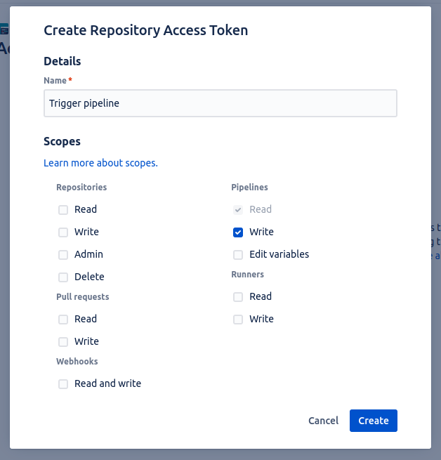
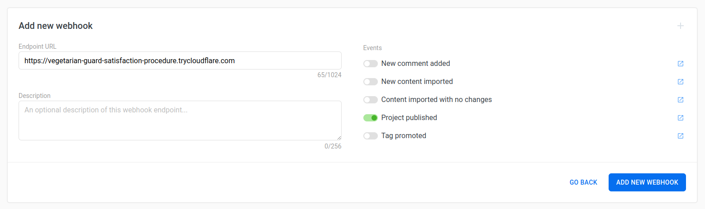
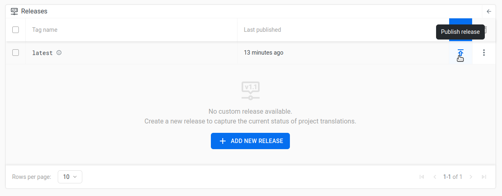

# Webhook Example

This is an example of how to connect a Localazy webhook with the Bitbucket API and trigger Bitbucket Pipelines.

The demonstration server contains an endpoint that will serve as an intermediary between the Localazy webhook and the Bitbucket API. The Localazy webhook will call the endpoint,
which will connect to the Bitbucket API and trigger the pipeline.

## Environmental variables

Before you can run the example, you must update the variables in the [.env](.env) file.

| Name                    | Description                             |
|-------------------------|-----------------------------------------|
| BITBUCKET_WORKSPACE     | Workspace slug from your repository url |
| BITBUCKET_REPOSITORY    | Project slug from your repository url   |
| BITBUCKET_BRANCH        | Branch whose pipeline we want to run    |
| BITBUCKET_TOKEN         | Bitbucket access token                  |
| LOCALAZY_WEBHOOK_SECRET | Localazy webhook secret                 |

### Bitbucket Access Token

In your Bitbucket repository, go to **Repository Settings > Access tokens** and create new access token. To trigger workflow you need to set up write access to pipelines.



### Localazy Webhook Secret

To verify that request came from Localazy you need to know project webhook secret. You can get with following request:

```bash
curl --request GET \
  --url https://api.localazy.com/projects/<project-slug>/webhooks/secret \
  --header 'Authorization: Bearer <project-token>'
```

Replace `<project-slug>` with your project, and replace `<project-token>` with the token you obtain at https://localazy.com/console/tokens.

## Start Example Server

Run the following command in the `webhook-example` folder.

```bash
docker compose up
```

In the output, you will see a message containing a random temporary URL with tunnel pointing to your localhost:3000.

<details open><summary><i><samp>Server output</samp></i></summary>

<pre><samp>user@machine:~$ <kbd>docker compose up</kbd>
...
server-1  | 
server-1  | > webhook-example@1.0.0 start
server-1  | > node index.js
server-1  | 
server-1  | > Server running
tunel-1   | 2024-02-21T22:45:55Z INF +--------------------------------------------------------------------------------------------+
tunel-1   | 2024-02-21T22:45:55Z INF |  Your quick Tunnel has been created! Visit it at (it may take some time to be reachable):  |
tunel-1   | 2024-02-21T22:45:55Z INF |  https://vegetarian-guard-satisfaction-procedure.trycloudflare.com                         |
tunel-1   | 2024-02-21T22:45:55Z INF +--------------------------------------------------------------------------------------------+
</samp></pre>
</details>

## Create a webhook in Localazy

Select the project from your [Dashboard](https://localazy.com/my/dashboard) and go to **Project settings > Webhooks** and add new webhook. Into the **Endpoint URL**, copy the URL
of your tunnel from the previous step and select **Project published** event.



## Your automatic translations download is set!

Check that everything works by making a release in your Localazy project, in your project go to **Tools > Releases** and add click publish release.



Your server should receive a request from Localazy and trigger the Bitbucket pipeline.

<details open><summary><i><samp>Server output</samp></i></summary>

<pre><samp>user@machine:~$ <kbd>docker compose up</kbd>
...
server-1  | Processing incoming request
server-1  | Request signature has been verified
server-1  | Starting Bitbucket pipeline
server-1  | Bitbucket pipeline successfully started
</samp></pre>
</details>

Now you can set up your own endpoint and connect Localazy with Bitbucket Pipelines.
